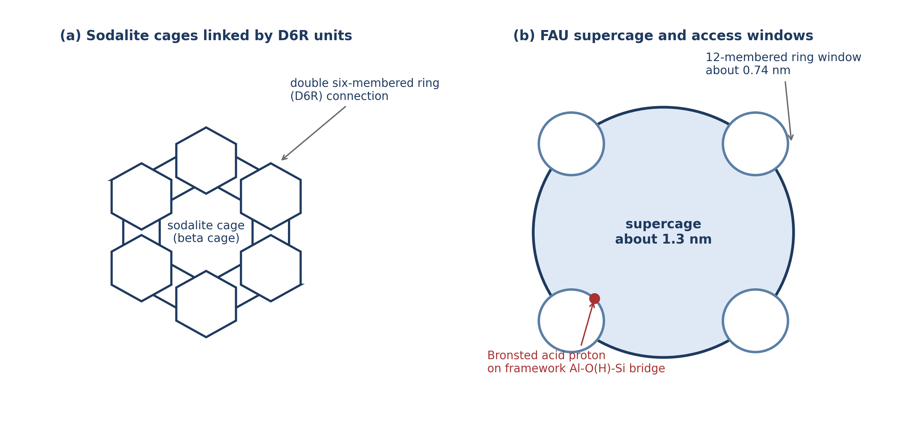

# CHAPTER TWO

# LITERATURE REVIEW

## 2.1 Petroleum Refining and Fluid Catalytic Cracking

Petroleum refining converts crude oil into fuels, petrochemicals, and specialty products through a sequence of physical and chemical processing steps. Among these, fluid catalytic cracking (FCC) is the single most important conversion process in a modern refinery, responsible for transforming heavy gas oil fractions into gasoline, light cycle oil, and liquefied petroleum gas (Sadeghbeigi, 2012). The FCC unit typically accounts for 30 to 45 percent of a refinery's total gasoline output and represents the primary upgrading pathway for vacuum gas oil (Vogt & Weckhuysen, 2015).

In an FCC unit, the preheated heavy feed enters a vertical riser reactor, where it contacts a stream of hot, regenerated catalyst particles at temperatures between 500 and 550 degrees Celsius. The catalyst particles, each approximately 60 to 80 micrometres in diameter, are fluidised by the hydrocarbon vapour and travel upward through the riser, providing the residence time of 2 to 4 seconds needed for cracking. At the top of the riser, the spent catalyst, now coated with carbonaceous deposits (coke), is separated from the product vapours and directed to a regenerator. In the regenerator, the coke is burned off at 680 to 730 degrees Celsius in air, restoring catalytic activity and providing the heat required to sustain the endothermic cracking reactions (Sadeghbeigi, 2012; Vogt & Weckhuysen, 2015).

Residue fluid catalytic cracking (RFCC) is an extension of conventional FCC designed to process heavier, bottom-of-the-barrel feeds such as atmospheric residue and vacuum residue. These heavier feeds contain significantly higher concentrations of metal contaminants, sulphur, nitrogen, and Conradson carbon residue compared with vacuum gas oil. The shift toward RFCC has been driven by the need to maximise the conversion of each barrel of crude oil, particularly in refineries processing heavy or opportunity crudes (Akah & Al-Ghrami, 2015). Nigerian refineries, which process crude oils that can contain vanadium concentrations ranging from 1 to over 50 parts per million by weight, face particular challenges from metal contamination of FCC catalysts (Okonkwo et al., 2017; Adenenche et al., 2022).

## 2.2 The FCC Catalyst: Zeolite Y

### 2.2.1 Structure and Framework Chemistry

The active cracking component of every modern FCC catalyst is a synthetic zeolite designated as type Y, which belongs to the faujasite (FAU) structural family. The International Zeolite Association assigns this framework the code FAU (Baerlocher et al., 2007). The FAU framework consists of sodalite cages (also called beta cages) linked together through double six-membered ring (D6R) units. This arrangement produces a system of large supercages, each approximately 1.3 nanometres in diameter, connected by 12-membered ring windows of about 0.74 nanometres aperture. These supercages are the sites where hydrocarbon cracking reactions take place (Baerlocher et al., 2007; Vermeiren & Gilson, 2009).

The framework is built from corner-sharing TO₄ tetrahedra, where T represents either silicon or aluminium. Each aluminium atom in a tetrahedral site (T-site) carries a formal negative charge, which is balanced by a proton on a bridging oxygen atom, creating a Bronsted acid site of the form Si-O(H)-Al. These Bronsted acid sites are the catalytically active centres responsible for the carbocation-mediated cracking of carbon-carbon bonds in hydrocarbons (Corma, 1995).

### 2.2.2 The Role of Framework Aluminium

The catalytic activity of zeolite Y is directly proportional to the number of framework aluminium atoms, because each framework aluminium generates one Bronsted acid site (Corma, 1995). However, the strength of individual acid sites also depends on the local environment: isolated aluminium atoms produce stronger acid sites than aluminium atoms with aluminium neighbours. 

Any process that removes aluminium from the framework, termed dealumination, directly reduces the number of acid sites and therefore the cracking activity. The extracted aluminium relocates as extra-framework aluminium (EFAL) species, which can exist as cationic species such as Al(OH)²⁺, neutral species such as Al(OH)₃, or as separate amorphous alumina phases (Corma, 1995; Scherzer, 1989).

## 2.3 Catalyst Deactivation in FCC Units

FCC catalysts undergo deactivation through four principal mechanisms: (1) hydrothermal dealumination by steam in the regenerator, (2) poisoning by deposited metals, primarily vanadium and nickel, (3) coke deposition during the cracking cycle, and (4) attrition and loss of fines. Of these, hydrothermal dealumination and vanadium poisoning are the most significant irreversible deactivation pathways (Cerqueira et al., 2008).

### 2.3.1 The Steam vs. Vanadium Debate

A major point of contention in catalyst deactivation literature is the relative contribution of steam (hydrothermal degradation) versus vanadium to the destruction of the zeolite framework. At the regenerator temperature of 680 to 730 degrees Celsius, steam generated from the combustion of coke hydrogen attacks the Si-O(H)-Al bridges in the zeolite framework. The hydrolysis reaction can be represented as:

Si-O(H)-Al(framework) + H₂O → Si-OH + HO-Al(EFAL)         (2.1)

Some researchers, notably evaluating operations with lower metal feeds, argue that steam alone is the primary driver of dealumination, asserting that vanadium merely exacerbates an already aggressive hydrothermal environment (Silaghi et al., 2015). Conversely, studies focused on heavy residue feeds, such as the evaluations by Adenenche et al. (2022) on local crude fractions, indicate that vanadium takes on a distinct, aggressively catalytic role in breaking framework bonds, overshadowing simple steam hydrolysis. Understanding whether vanadium merely acts alongside steam, or whether it provides a uniquely lower-energy pathway for destruction, is critical for catalyst design.

## 2.4 Vanadium Poisoning of FCC Catalysts

### 2.4.1 The Mobility of Vanadium Under Regenerator Conditions

Heavy petroleum feeds contain organometallic compounds of vanadium and nickel. During cracking, these metals deposit on the catalyst surface. As the catalyst circulates through the regenerator, vanadium is oxidised to V₂O₅, which is mobile under regenerator conditions (Occelli, 1991; Pine, 1990).

The destructive power of vanadium arises from the formation of volatile vanadic acid (ortho-vanadic acid, H₃VO₄) in the steam-rich regenerator atmosphere. The reaction can be written as:

V₂O₅(l) + 3 H₂O(g) → 2 H₃VO₄(g)         (2.2)

Wormsbecher et al. (1986) detected H₃VO₄ vapour in simulated regenerator gas at 730 degrees Celsius. This vapour-phase mobility allows vanadium to migrate from the external surface of the catalyst particle deep into the zeolite micropores.

### 2.4.2 Experimental Evidence of Vanadium-Accelerated Dealumination

Pine (1990) demonstrated through systematic steaming experiments that vanadium dramatically accelerates the destruction of USY zeolite compared to steam alone. Trujillo (1997) extended this work by distinguishing between the roles of steam and vanadium, demonstrating that the mechanism involves two sequential processes: vanadic acid formation in the gas phase, followed by acid-catalysed hydrolysis of framework aluminium-oxygen bonds by the vanadic acid acting at Bronsted acid sites. 

Etim et al. (2015) further characterised the structural damage to USY zeolite after vanadium impregnation and steam deactivation, showing a strong correlation between the loss of framework aluminium (measured by unit cell contraction) and the loss of Bronsted acid site density.

## 2.5 Computational Studies of Zeolite Reactivity

### 2.5.1 Cluster Models for Zeolite Active Sites

Direct experimental observation of individual bond-breaking events in zeolites is not possible with current techniques. Computational chemistry, particularly density functional theory (DFT), provides access to these atomistic details (van Santen & Kramer, 1995). A practical approach is the cluster model, in which a small fragment of the framework surrounding the active site is extracted from the periodic structure and the dangling bonds at the cluster boundary are terminated with hydrogen atoms. Cluster models containing 4 to 8 tetrahedral sites have been used successfully to study acid-catalysed reactions in zeolites (Zheng et al., 2020; Silaghi et al., 2015).

### 2.5.2 Semi-Empirical Methods: The GFN2-xTB Approach

Before investing in expensive DFT geometry optimisations, it is advantageous to explore the potential energy surface at a lower level of theory to identify plausible reaction pathways. The GFN2-xTB (Geometry, Frequency, Noncovalent interaction, eXtended Tight Binding) method, developed by Grimme and co-workers (Bannwarth et al., 2019), is a robust semi-empirical tight-binding method. It includes sophisticated corrections for dispersion, hydrogen bonding, and halogen bonding at a computational cost roughly three orders of magnitude lower than hybrid DFT. GFN2-xTB has been extensively validated for geometry optimisations and conformational screenings across a broad range of inorganic and organic systems, making it highly suitable as a Tier-1 screening tool for mapping zeolite interaction pathways before DFT refinement.

### 2.5.3 Density Functional Theory in Catalysis

The accuracy of a DFT calculation depends on the choice of exchange-correlation functional. Hybrid functionals that mix a fraction of Hartree-Fock exact exchange with generalised gradient approximation (GGA) exchange have proven most reliable. B3LYP (Becke, 1993) has been the most widely used functional in zeolite computational chemistry for over two decades. PBE0 (Adamo & Barone, 1999) provides a useful internal consistency check with no empirical parameters.

To capture London dispersion interactions, which are critical in zeolite chemistry, Grimme's D3 dispersion correction with Becke-Johnson (BJ) damping is applied (Grimme et al., 2011). Combined with the def2-TZVP basis set (Weigend & Ahlrichs, 2005), this represents the current standard of practice for DFT studies of zeolite catalysis (Goerigk et al., 2017).

## 2.6 Summary and Identification of Research Gap

The literature establishes the consensus that vanadium is oxidised to V₂O₅ in the regenerator, which reacts with steam to form volatile H₃VO₄. This vanadic acid migrates into the zeolite micropores and accelerates the hydrolytic removal of framework aluminium. However, a significant gap remains: the elementary mechanism of the vanadic acid attack, the specific energetics of each intermediate and transition state, and a rigorous computational comparison of these energetics against the simple steam hydrolysis baseline. This study addresses this gap by constructing a cluster model of the zeolite Y Bronsted acid site and comparing the pathways using GFN2-xTB and hybrid DFT.
