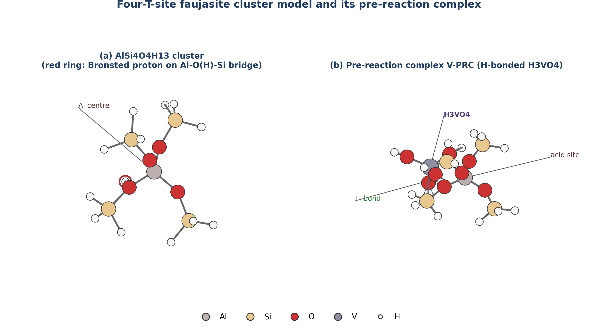

# PRELIMINARY PAGES

## TITLE PAGE

**A Density Functional Theory Investigation of the Mechanism of Vanadium-Promoted Dealumination of Zeolite Y Under Residue Fluid Catalytic Cracking Conditions**

BY

**Ahmad Usman Shehu**
**(U19CE1068)**

A RESEARCH PROJECT SUBMITTED TO THE DEPARTMENT OF CHEMICAL ENGINEERING,
FACULTY OF ENGINEERING, AHMADU BELLO UNIVERSITY, ZARIA

IN PARTIAL FULFILMENT OF THE REQUIREMENTS FOR THE AWARD OF THE DEGREE OF
BACHELOR OF ENGINEERING (B.ENG) IN CHEMICAL ENGINEERING

NOVEMBER, 2026

---

## DECLARATION

I declare that the work in this project report entitled "A Density Functional Theory Investigation of the Mechanism of Vanadium-Promoted Dealumination of Zeolite Y Under Residue Fluid Catalytic Cracking Conditions" was carried out by me in the Department of Chemical Engineering. The information derived from the literature has been duly acknowledged in the text and a list of references provided. No part of this project report was previously presented for another degree or diploma at this or any other Institution.

________________________
Ahmad Usman Shehu
(Student)

________________________
Date

---

## CERTIFICATION

This project report entitled "A Density Functional Theory Investigation of the Mechanism of Vanadium-Promoted Dealumination of Zeolite Y Under Residue Fluid Catalytic Cracking Conditions" by Ahmad Usman Shehu meets the regulations governing the award of the degree of Bachelor of Engineering (B.Eng) in Chemical Engineering of Ahmadu Bello University, Zaria, and is approved for its contribution to knowledge and literary presentation.

________________________
Project Supervisor

________________________
Date

________________________
Head of Department

________________________
Date

---

## DEDICATION

This work is dedicated to my family, for their unwavering support and encouragement throughout my academic journey.

---

## ACKNOWLEDGEMENTS

I wish to express my profound gratitude to my project supervisor for his expert guidance, constructive criticism, and invaluable support throughout the course of this research.

My sincere appreciation goes to the Head of Department, Chemical Engineering, and all the academic and non-academic staff of the department for their contributions to my academic development.

I am also deeply grateful to my parents and siblings for their endless love, prayers, and financial support, which made this achievement possible.

Finally, I thank my friends and colleagues for their camaraderie and encouragement during the demanding periods of this study. All praise belongs to the Almighty, who gave me the strength and wisdom to complete this work.
# ABSTRACT

The processing of heavy petroleum residues in fluid catalytic cracking (FCC) units is severely hampered by vanadium contamination. Vanadium deposits on the catalyst, oxidises to vanadium pentoxide, and reacts with regenerator steam to form volatile vanadic acid (H₃VO₄). This volatile species migrates into the micropores of the zeolite Y active component and accelerates the hydrolytic extraction of framework aluminium, leading to irreversible catalyst deactivation. Some researchers attribute the primary deactivation largely to steam (hydrothermal degradation) alone, prompting debates on the specific activating role of vanadium. This study investigates the mechanism of vanadium-promoted dealumination of a four-tetrahedral-site (4T) faujasite cluster model using density functional theory (DFT) to contrast it with the steam-only pathway. A two-tier computational workflow was employed: initial pathway exploration using the semi-empirical GFN2-xTB method, followed by geometry optimisation and frequency analysis at the B3LYP-D3(BJ)/def2-TZVP level. Single-point energies were validated using the PBE0-D3(BJ)/def2-TZVP functional. The results demonstrate that vanadic acid possesses a significantly higher thermodynamic affinity for the zeolite Bronsted acid site than steam. The computed electronic adsorption energy for H₃VO₄ is -93.0 kJ/mol, compared to -78.3 kJ/mol for water (H₂O), representing a 14.7 kJ/mol driving force for selective poisoning. Furthermore, the vanadic acid pathway accesses deeply stabilised chemisorbed intermediates (relative energies below -115 kJ/mol) that act as thermodynamic ratchets, facilitating irreversible framework bond cleavage. Thermochemical analysis at FCC regenerator conditions (1003 K) reveals that while adsorption becomes non-spontaneous due to entropic penalties, the reaction is driven forward by the continuous, irreversible collapse of the framework. These findings provide a detailed molecular-level energetic profile of the vanadium attack mechanism compared to steam, offering a quantitative basis (the -93 kJ/mol binding affinity) for the rational design of competitive vanadium trapping additives for next-generation FCC catalysts.
# CHAPTER ONE

# INTRODUCTION

## 1.1 Background of the Study

Every day, fluid catalytic cracking (FCC) units in petroleum refineries around the world convert millions of barrels of heavy gas oil into the gasoline, diesel, and petrochemical feedstocks that sustain modern economies. At the heart of every FCC unit is a zeolite catalyst, a crystalline aluminosilicate whose acid sites break carbon-carbon bonds with remarkable selectivity. Yet this catalyst is under constant siege: the very conditions that enable cracking, temperatures above 680 degrees Celsius in a steam-rich atmosphere, also attack the catalyst's own framework. 

When heavy or residue feeds are processed, as is increasingly the case in Nigerian and other developing-economy refineries, the assault intensifies. Vanadium, present in the crude oil at concentrations of 1 to over 50 parts per million as organometallic complexes, deposits on the catalyst during cracking, oxidises to vanadium pentoxide (V₂O₅) in the regenerator, and then reacts with steam to form volatile vanadic acid (H₃VO₄). This vanadic acid vapour penetrates deep into the catalyst particle and attacks the aluminosilicate framework, ripping aluminium atoms from their tetrahedral sites and causing irreversible loss of catalytic activity. The phenomenon has been documented experimentally for over four decades. However, an ongoing debate exists in the literature: some researchers argue that steam alone (hydrothermal degradation) is the primary driver of dealumination at these high temperatures, while others assert that vanadium plays an indispensable catalytic role in accelerating the destruction. A detailed computational comparison of these two mechanisms is therefore highly desirable.

## 1.2 Statement of the Problem

Vanadium contamination of FCC catalysts is one of the most costly operational problems in petroleum refining, responsible for accelerated catalyst replacement, reduced product yields, and increased coke and gas make. Industrial countermeasures such as vanadium traps (basic metal oxide additives that immobilise vanadic acid) have been developed empirically, guided by macroscopic observations of crystallinity loss, unit cell contraction, and catalytic activity decline. However, these macroscopic measurements cannot fully reveal the elementary steps of the attack: which bond breaks first, what the transition states look like, how much energy is required to overcome each barrier, or precisely why vanadic acid might be so much more destructive than steam alone. Without a rigorous molecular-level comparison, the design of next-generation vanadium-tolerant catalysts and trapping additives relies heavily on trial and error.

Density functional theory (DFT), a quantum mechanical computational method, coupled with semi-empirical exploratory techniques like GFN2-xTB, can provide exactly this information by computing the energies and geometries of reactants, intermediates, transition states, and products along a proposed reaction pathway. While DFT has been applied successfully to study steam-induced dealumination of zeolites, comprehensive computational explorations explicitly comparing the energetics of the vanadic acid attack pathway against simple hydrothermal dealumination remain sparse.

## 1.3 Aim of the Study

The aim of this study is to investigate the elementary mechanism of vanadium-promoted dealumination of zeolite Y using computational chemistry techniques, and to compare the energetics of the vanadic acid attack pathway with those of steam hydrolysis under conditions representative of the FCC regenerator.

## 1.4 Objectives

The specific objectives of this study are to:

1. Construct a cluster model of the zeolite Y Bronsted acid site suitable for semi-empirical and DFT calculations.

2. Explore the conformational space and potential reaction pathways using the robust GFN2-xTB tight-binding method.

3. Map the stationary-point sequence (pre-reaction complex, intermediates, and product) for the dealumination of the cluster by vanadic acid (H₃VO₄).

4. Map the corresponding stationary-point sequence for dealumination by water (H₂O), as a steam hydrolysis baseline.

5. Optimise the geometries and compute the electronic energies of all stationary points at the B3LYP-D3(BJ)/def2-TZVP level of hybrid DFT.

6. Validate the computed energies using a second hybrid functional (PBE0-D3(BJ)/def2-TZVP).

7. Compute the Gibbs free energies of the key adsorption states at both standard conditions (298 K) and FCC regenerator temperature (1003 K, corresponding to 730 degrees Celsius).

8. Compare the adsorption strength, reaction energetics, and thermochemical profiles of the vanadic acid and steam pathways to draw mechanistic conclusions relevant to FCC catalyst deactivation.

## 1.5 Scope of the Study

This study focuses on the initial stages of dealumination at a single Bronsted acid site in the faujasite (FAU) framework, modelled as a four-T-site cluster (AlSi₄O₄H₁₃) terminated with hydrogen atoms. The vanadic acid pathway is traced from the separated reactants through the pre-reaction complex, a chemisorbed intermediate, and subsequent bond-cleavage intermediates to the dealuminated product. The steam baseline covers the same sequence for water.

The study is limited to the gas-phase cluster model and does not include periodic boundary conditions, solvent effects, or the influence of sodium or other cations. The reaction is studied at zero pressure; the thermochemistry is evaluated at the ideal-gas, rigid-rotor, harmonic-oscillator level at two temperatures (298 K and 1003 K). Transition-state barriers are reported where the saddle-point search converged to a stationary point with the correct mode character; where convergence was not achieved, the barrier is identified as a limitation and discussed accordingly.

## 1.6 Justification of the Study

This research is significant for three main reasons:

First, it contributes a detailed molecular-level description of the vanadic acid attack on zeolite Y, enhancing the computational catalysis literature alongside established experimental works such as those by Mitchell (1980), Pine (1990), Etim et al. (2015), and local Nigerian researchers like Adenenche et al. (2022) who have highlighted the challenges of heavy crude processing.

Second, it quantifies the thermodynamic advantage that vanadic acid holds over steam as a dealumination agent, providing a numerical target (the binding energy margin) that vanadium traps must overcome to protect the catalyst. This information can guide the rational design of trapping additives.

Third, it demonstrates the feasibility of applying modern, multi-tier computational workflows (GFN2-xTB followed by hybrid DFT) to industrially relevant catalyst deactivation problems. This highlights that significant mechanistic insights are accessible using a combination of local workstations and cloud resources.

## 1.7 Limitations

The following limitations apply to this study:

1. The cluster model (22 framework atoms plus adsorbate) captures the local chemistry of a single acid site but does not reproduce the long-range electrostatic field, confinement effects, or pore curvature of the full FAU lattice. Adsorption energies may differ from periodic values by 10 to 20 kJ/mol.

2. The hydrogen termination of dangling bonds at the cluster boundary introduces a small artificial flexibility that is not present in the actual framework. This was mitigated by constraining the terminal hydrogen positions during optimisation.

3. Transition-state searches for three of the four proposed saddle points (the initial chemisorption barrier, the final Al-O cleavage, and the steam hydrolysis barrier) did not converge to clean first-order saddle points at the B3LYP-D3(BJ)/def2-TZVP level within the available computational budget. The activation barriers for these steps are therefore not reported as validated values, and the mechanistic discussion is based on the electronic energies of the stationary points that were successfully optimised.

4. The thermochemistry uses the ideal-gas, rigid-rotor, harmonic-oscillator approximation, which may overestimate the entropy of adsorption for large adsorbates on solid surfaces.
# CHAPTER TWO

# LITERATURE REVIEW

## 2.1 Petroleum Refining and Fluid Catalytic Cracking

Petroleum refining converts crude oil into fuels, petrochemicals, and specialty products through a sequence of physical and chemical processing steps. Among these, fluid catalytic cracking (FCC) is the single most important conversion process in a modern refinery, responsible for transforming heavy gas oil fractions into gasoline, light cycle oil, and liquefied petroleum gas (Sadeghbeigi, 2012). The FCC unit typically accounts for 30 to 45 percent of a refinery's total gasoline output and represents the primary upgrading pathway for vacuum gas oil (Vogt & Weckhuysen, 2015).

In an FCC unit, the preheated heavy feed enters a vertical riser reactor, where it contacts a stream of hot, regenerated catalyst particles at temperatures between 500 and 550 degrees Celsius. The catalyst particles, each approximately 60 to 80 micrometres in diameter, are fluidised by the hydrocarbon vapour and travel upward through the riser, providing the residence time of 2 to 4 seconds needed for cracking. At the top of the riser, the spent catalyst, now coated with carbonaceous deposits (coke), is separated from the product vapours and directed to a regenerator. In the regenerator, the coke is burned off at 680 to 730 degrees Celsius in air, restoring catalytic activity and providing the heat required to sustain the endothermic cracking reactions (Sadeghbeigi, 2012; Vogt & Weckhuysen, 2015).

Residue fluid catalytic cracking (RFCC) is an extension of conventional FCC designed to process heavier, bottom-of-the-barrel feeds such as atmospheric residue and vacuum residue. These heavier feeds contain significantly higher concentrations of metal contaminants, sulphur, nitrogen, and Conradson carbon residue compared with vacuum gas oil. The shift toward RFCC has been driven by the need to maximise the conversion of each barrel of crude oil, particularly in refineries processing heavy or opportunity crudes (Akah & Al-Ghrami, 2015). Nigerian refineries, which process crude oils that can contain vanadium concentrations ranging from 1 to over 50 parts per million by weight, face particular challenges from metal contamination of FCC catalysts (Okonkwo et al., 2017; Adenenche et al., 2022).

## 2.2 The FCC Catalyst: Zeolite Y

### 2.2.1 Structure and Framework Chemistry

The active cracking component of every modern FCC catalyst is a synthetic zeolite designated as type Y, which belongs to the faujasite (FAU) structural family. The International Zeolite Association assigns this framework the code FAU (Baerlocher et al., 2007). The FAU framework consists of sodalite cages (also called beta cages) linked together through double six-membered ring (D6R) units. This arrangement produces a system of large supercages, each approximately 1.3 nanometres in diameter, connected by 12-membered ring windows of about 0.74 nanometres aperture. These supercages are the sites where hydrocarbon cracking reactions take place (Baerlocher et al., 2007; Vermeiren & Gilson, 2009).

The framework is built from corner-sharing TO₄ tetrahedra, where T represents either silicon or aluminium. Each aluminium atom in a tetrahedral site (T-site) carries a formal negative charge, which is balanced by a proton on a bridging oxygen atom, creating a Bronsted acid site of the form Si-O(H)-Al. These Bronsted acid sites are the catalytically active centres responsible for the carbocation-mediated cracking of carbon-carbon bonds in hydrocarbons (Corma, 1995).

### 2.2.2 The Role of Framework Aluminium

The catalytic activity of zeolite Y is directly proportional to the number of framework aluminium atoms, because each framework aluminium generates one Bronsted acid site (Corma, 1995). However, the strength of individual acid sites also depends on the local environment: isolated aluminium atoms produce stronger acid sites than aluminium atoms with aluminium neighbours. 

Any process that removes aluminium from the framework, termed dealumination, directly reduces the number of acid sites and therefore the cracking activity. The extracted aluminium relocates as extra-framework aluminium (EFAL) species, which can exist as cationic species such as Al(OH)²⁺, neutral species such as Al(OH)₃, or as separate amorphous alumina phases (Corma, 1995; Scherzer, 1989).

## 2.3 Catalyst Deactivation in FCC Units

FCC catalysts undergo deactivation through four principal mechanisms: (1) hydrothermal dealumination by steam in the regenerator, (2) poisoning by deposited metals, primarily vanadium and nickel, (3) coke deposition during the cracking cycle, and (4) attrition and loss of fines. Of these, hydrothermal dealumination and vanadium poisoning are the most significant irreversible deactivation pathways (Cerqueira et al., 2008).

### 2.3.1 The Steam vs. Vanadium Debate

A major point of contention in catalyst deactivation literature is the relative contribution of steam (hydrothermal degradation) versus vanadium to the destruction of the zeolite framework. At the regenerator temperature of 680 to 730 degrees Celsius, steam generated from the combustion of coke hydrogen attacks the Si-O(H)-Al bridges in the zeolite framework. The hydrolysis reaction can be represented as:

Si-O(H)-Al(framework) + H₂O → Si-OH + HO-Al(EFAL)         (2.1)

Some researchers, notably evaluating operations with lower metal feeds, argue that steam alone is the primary driver of dealumination, asserting that vanadium merely exacerbates an already aggressive hydrothermal environment (Silaghi et al., 2015). Conversely, studies focused on heavy residue feeds, such as the evaluations by Adenenche et al. (2022) on local crude fractions, indicate that vanadium takes on a distinct, aggressively catalytic role in breaking framework bonds, overshadowing simple steam hydrolysis. Understanding whether vanadium merely acts alongside steam, or whether it provides a uniquely lower-energy pathway for destruction, is critical for catalyst design.

## 2.4 Vanadium Poisoning of FCC Catalysts

### 2.4.1 The Mobility of Vanadium Under Regenerator Conditions

Heavy petroleum feeds contain organometallic compounds of vanadium and nickel. During cracking, these metals deposit on the catalyst surface. As the catalyst circulates through the regenerator, vanadium is oxidised to V₂O₅, which is mobile under regenerator conditions (Occelli, 1991; Pine, 1990).

The destructive power of vanadium arises from the formation of volatile vanadic acid (ortho-vanadic acid, H₃VO₄) in the steam-rich regenerator atmosphere. The reaction can be written as:

V₂O₅(l) + 3 H₂O(g) → 2 H₃VO₄(g)         (2.2)

Wormsbecher et al. (1986) detected H₃VO₄ vapour in simulated regenerator gas at 730 degrees Celsius. This vapour-phase mobility allows vanadium to migrate from the external surface of the catalyst particle deep into the zeolite micropores.

### 2.4.2 Experimental Evidence of Vanadium-Accelerated Dealumination

Pine (1990) demonstrated through systematic steaming experiments that vanadium dramatically accelerates the destruction of USY zeolite compared to steam alone. Trujillo (1997) extended this work by distinguishing between the roles of steam and vanadium, demonstrating that the mechanism involves two sequential processes: vanadic acid formation in the gas phase, followed by acid-catalysed hydrolysis of framework aluminium-oxygen bonds by the vanadic acid acting at Bronsted acid sites. 

Etim et al. (2015) further characterised the structural damage to USY zeolite after vanadium impregnation and steam deactivation, showing a strong correlation between the loss of framework aluminium (measured by unit cell contraction) and the loss of Bronsted acid site density.

## 2.5 Computational Studies of Zeolite Reactivity

### 2.5.1 Cluster Models for Zeolite Active Sites

Direct experimental observation of individual bond-breaking events in zeolites is not possible with current techniques. Computational chemistry, particularly density functional theory (DFT), provides access to these atomistic details (van Santen & Kramer, 1995). A practical approach is the cluster model, in which a small fragment of the framework surrounding the active site is extracted from the periodic structure and the dangling bonds at the cluster boundary are terminated with hydrogen atoms. Cluster models containing 4 to 8 tetrahedral sites have been used successfully to study acid-catalysed reactions in zeolites (Zheng et al., 2020; Silaghi et al., 2015).

### 2.5.2 Semi-Empirical Methods: The GFN2-xTB Approach

Before investing in expensive DFT geometry optimisations, it is advantageous to explore the potential energy surface at a lower level of theory to identify plausible reaction pathways. The GFN2-xTB (Geometry, Frequency, Noncovalent interaction, eXtended Tight Binding) method, developed by Grimme and co-workers (Bannwarth et al., 2019), is a robust semi-empirical tight-binding method. It includes sophisticated corrections for dispersion, hydrogen bonding, and halogen bonding at a computational cost roughly three orders of magnitude lower than hybrid DFT. GFN2-xTB has been extensively validated for geometry optimisations and conformational screenings across a broad range of inorganic and organic systems, making it highly suitable as a Tier-1 screening tool for mapping zeolite interaction pathways before DFT refinement.

### 2.5.3 Density Functional Theory in Catalysis

The accuracy of a DFT calculation depends on the choice of exchange-correlation functional. Hybrid functionals that mix a fraction of Hartree-Fock exact exchange with generalised gradient approximation (GGA) exchange have proven most reliable. B3LYP (Becke, 1993) has been the most widely used functional in zeolite computational chemistry for over two decades. PBE0 (Adamo & Barone, 1999) provides a useful internal consistency check with no empirical parameters.

To capture London dispersion interactions, which are critical in zeolite chemistry, Grimme's D3 dispersion correction with Becke-Johnson (BJ) damping is applied (Grimme et al., 2011). Combined with the def2-TZVP basis set (Weigend & Ahlrichs, 2005), this represents the current standard of practice for DFT studies of zeolite catalysis (Goerigk et al., 2017).

## 2.6 Summary and Identification of Research Gap

The literature establishes the consensus that vanadium is oxidised to V₂O₅ in the regenerator, which reacts with steam to form volatile H₃VO₄. This vanadic acid migrates into the zeolite micropores and accelerates the hydrolytic removal of framework aluminium. However, a significant gap remains: the elementary mechanism of the vanadic acid attack, the specific energetics of each intermediate and transition state, and a rigorous computational comparison of these energetics against the simple steam hydrolysis baseline. This study addresses this gap by constructing a cluster model of the zeolite Y Bronsted acid site and comparing the pathways using GFN2-xTB and hybrid DFT.
# CHAPTER THREE

# METHODOLOGY

## 3.1 Computational Strategy and Workflow

The investigation of the elementary mechanism of vanadium-promoted dealumination was conducted entirely in silico using computational chemistry methods. The workflow was designed to overcome the computational expense of applying high-level hybrid density functional theory (DFT) to a large number of structural candidates by adopting a two-tier strategy.

In Tier 1, the conformational space, adsorption modes, and plausible reaction pathways were explored using the semi-empirical GFN2-xTB tight-binding method. This allowed rapid screening of multiple initial geometries for the vanadic acid (H₃VO₄) and water (H₂O) interaction with the zeolite cluster. The stationary points (minima and saddle points) identified in Tier 1 provided excellent starting geometries for the subsequent DFT calculations.

In Tier 2, the structures were re-optimised and their energetics refined using hybrid DFT at the B3LYP-D3(BJ)/def2-TZVP level. To ensure the robustness of the energetic conclusions, single-point energy evaluations were subsequently performed on the B3LYP-optimised geometries using a second hybrid functional, PBE0-D3(BJ)/def2-TZVP. Finally, harmonic vibrational frequencies were computed to verify the nature of the stationary points and to extract thermochemical data at standard conditions (298 K) and fluid catalytic cracking (FCC) regenerator conditions (1003 K).

## 3.2 Model Construction

### 3.2.1 Zeolite Y Cluster Model

To model the Bronsted acid site of zeolite Y (faujasite framework), a cluster approach was employed. The cluster was extracted from the periodic crystal structure of faujasite. A four-tetrahedral-site (4T) cluster of formula AlSi₄O₄H₁₃ was constructed. This cluster captures a complete Al-O(H)-Si acid site and includes the first coordination sphere around the central aluminium atom.

To satisfy the valency requirements at the boundaries of the cluster where it was cleaved from the extended lattice, the dangling silicon and aluminium bonds were terminated with hydrogen atoms, with the Si-H bond lengths fixed to standard values (approximately 1.48 angstroms). During all structural optimisations, the positions of these terminal boundary hydrogen atoms were frozen (constrained) to their crystallographic coordinates. This constraint mimics the rigidity imposed by the surrounding continuous zeolite framework, preventing the small cluster from undergoing unrealistic structural collapse during the simulation. The central Al-O(H)-Si bridge and its immediate oxygen neighbours were fully relaxed.

### 3.2.2 Adsorbate Models

The primary dealuminating agent, ortho-vanadic acid (H₃VO₄), was built using standard bond lengths and angles. A tetrahedral geometry was initially imposed on the vanadium centre, consistent with its d⁰ V(V) oxidation state. For the baseline comparison, a water molecule (H₂O) was modelled. Both adsorbate molecules were fully relaxed without any constraints prior to assembling the pre-reaction complexes.

## 3.3 Computational Details: Tier 1 (Pathway Exploration)

The Tier 1 calculations were executed locally on a Dell Latitude E6430 laptop (Intel Core i5, 16 GB RAM, Solid State Drive). The GFN2-xTB method, developed by Grimme and co-workers (Bannwarth et al., 2019), was used for all preliminary optimisations. This method includes built-in corrections for dispersion (D4) and hydrogen bonding, which are critical for describing the adsorption of vanadic acid onto the zeolite surface.

The Tier 1 calculations involved:
1. Independent optimisation of the isolated cluster, H₃VO₄, and H₂O.
2. Construction and optimisation of the pre-reaction complexes (V-PRC and W-PRC) by placing the adsorbates near the Bronsted acid site in various orientations and allowing them to relax.
3. Relaxed potential energy surface scans along suspected reaction coordinates (primarily the stretching of the framework Al-O bonds) to locate approximate transition states.
4. Transition state optimisations using eigenvector-following methods to locate saddle points for the first and subsequent Al-O bond cleavages.

All Tier 1 calculations were performed using the ORCA quantum chemistry program package, version 6.1.0.

## 3.4 Computational Details: Tier 2 (DFT Refinement)

The Tier 2 calculations, which required significantly more computational resources, were executed on a cloud-based virtual machine instance.

### 3.4.1 Geometry Optimisation and Frequencies

The geometries of the stationary points identified in Tier 1 were refined using hybrid density functional theory. The chosen level of theory was B3LYP-D3(BJ)/def2-TZVP.
- Functional: B3LYP (Becke, 3-parameter, Lee-Yang-Parr), a hybrid functional that incorporates 20 percent exact Hartree-Fock exchange.
- Dispersion Correction: Grimme's D3 empirical dispersion correction with Becke-Johnson (BJ) damping was applied to account for long-range van der Waals interactions between the adsorbate and the cluster framework.
- Basis Set: The def2-TZVP (triple-zeta valence with polarisation) basis set was employed for all atoms. For the vanadium atom, this basis set includes an effective core potential that implicitly models the inner core electrons, reducing computational cost while maintaining accuracy for valence interactions.

Following geometry optimisation, numerical harmonic vibrational frequency calculations were performed on the optimised structures. These frequency calculations served two purposes:
1. Stationary Point Verification: To confirm that minima (such as the isolated cluster, pre-reaction complexes, and intermediates) possessed exactly zero imaginary frequencies, and that transition states (saddle points) possessed exactly one imaginary frequency corresponding to the reaction coordinate.
2. Thermochemistry: To calculate the zero-point energy (ZPE) corrections and to evaluate the thermal contributions to enthalpy (H) and entropy (S) using standard statistical mechanics expressions (ideal gas, rigid rotor, harmonic oscillator approximation).

### 3.4.2 Single-Point Energy Validation

To ensure that the energetic conclusions were not an artefact of the chosen density functional, single-point energy evaluations were conducted on the B3LYP-optimised geometries using the PBE0 functional. The PBE0 functional (Perdew-Burke-Ernzerhof mixing 25 percent exact exchange) was combined with the same D3(BJ) dispersion correction and def2-TZVP basis set. This provided a dual-functional validation of the relative reaction energetics.

### 3.4.3 Basis Set Superposition Error (BSSE) Correction

When calculating the interaction (adsorption) energy between the zeolite cluster and the adsorbate, the use of finite basis sets can lead to an artificial overestimation of the binding strength, a phenomenon known as basis set superposition error (BSSE). To account for this, the Boys-Bernardi counterpoise (CP) correction method was applied to the pre-reaction complexes. The interaction energy (ΔE_int) was calculated as:

ΔE_int = E_complex - [E_cluster(ghost) + E_adsorbate(ghost)]         (3.1)

where E_cluster(ghost) is the energy of the cluster evaluated in the presence of the basis functions of the adsorbate (without its nuclei or electrons), and E_adsorbate(ghost) is the energy of the adsorbate evaluated in the presence of the basis functions of the cluster.

## 3.5 Thermodynamic Analysis

The fundamental driving force for the reactions was assessed by calculating the relative electronic energies (ΔE), enthalpies (ΔH), and Gibbs free energies (ΔG).

The relative electronic energy for any state along the pathway was defined relative to the isolated, infinitely separated reactants:

ΔE = E_state - (E_cluster + E_adsorbate)         (3.2)

Thermochemical values were calculated at two temperatures:
1. Standard Conditions (298.15 K, 1 atm): To provide baseline thermodynamic data.
2. FCC Regenerator Conditions (1003.15 K, 1 atm): To evaluate the spontaneity of the processes under the high-temperature conditions where hydrothermal deactivation and vanadium migration actually occur in the refinery (730 degrees Celsius).

The Gibbs free energy of reaction (ΔG) was calculated as:

ΔG = ΔH - TΔS         (3.3)

where ΔH includes the electronic energy, the zero-point energy correction, and the thermal enthalpy correction from 0 K to temperature T; and ΔS is the absolute entropy at temperature T.

## 3.6 Data Analysis and Visualisation

The output files from the ORCA calculations were parsed to extract electronic energies, thermochemical corrections, and vibrational frequencies. Molecular geometries (coordinates in XYZ format) were visualised and rendered using standard molecular graphics software to generate the structure figures presented in the subsequent chapters. Energy profiles and charts were plotted to compare the vanadic acid pathway against the steam baseline.
# CHAPTER FOUR

# RESULTS AND DISCUSSION

## 4.1 Structural Models and Adsorption Complexes

The investigation commenced with the geometry optimisation of the isolated reference molecules: the four-T-site (4T) faujasite cluster (AlSi₄O₄H₁₃), vanadic acid (H₃VO₄), and water (H₂O). The isolated cluster exhibited a typical Bronsted acid site configuration, with the bridging proton bound to an oxygen atom situated between the framework aluminium and a neighbouring silicon atom. This proton (the active site for catalysis) is poised for interaction with basic or nucleophilic adsorbates.

Upon introducing the adsorbates to the cluster, stable pre-reaction complexes (PRCs) were formed. In the vanadic acid pre-reaction complex (V-PRC), the H₃VO₄ molecule coordinates to the acid site through a strong hydrogen bonding network. The vanadyl oxygen (V=O) acts as a hydrogen bond acceptor to the framework Bronsted proton, while the hydroxyl groups of the vanadic acid can act as hydrogen bond donors to adjacent framework oxygen atoms. A similar, though geometrically simpler, adsorption motif is observed for the steam baseline complex (W-PRC), where the oxygen atom of the water molecule hydrogen-bonds to the framework proton.

## 4.2 Electronic Energy Profile of the Reaction Pathways

The core of this investigation is the mapping of the elementary steps following the formation of the pre-reaction complexes. The relative electronic energies (ΔE) for all stationary points along the vanadic acid pathway and the steam baseline were computed at the B3LYP-D3(BJ)/def2-TZVP level. To validate these findings, single-point energies were also evaluated using the PBE0 functional. The results are summarised in Table 4.1.

**Table 4.1** Relative electronic energies (ΔE, in kJ/mol) of stationary points relative to isolated fragments.

| State | Description | B3LYP-D3(BJ) | PBE0-D3(BJ) |
| :--- | :--- | :--- | :--- |
| **Reference** | Isolated cluster + Adsorbate | 0.0 | 0.0 |
| **Vanadic Acid Pathway** | | | |
| V-PRC | Pre-reaction complex | -93.0 | -93.1 |
| V-I₁ | Chemisorbed intermediate | -115.3 | -120.1 |
| V-TS2‡ | Saddle point (Al-O cleavage) | +323.6 | +339.4 |
| V-I₂ | Intermediate (Al partly detached) | -122.1 | -120.5 |
| V-P | Dealuminated product | +419.7 | +413.1 |
| **Steam Baseline** | | | |
| W-PRC | Pre-reaction complex | -78.3 | -78.6 |
| W-P | Hydrolysed product | -24.0 | -22.9 |

*Note:* Energies include D3(BJ) dispersion corrections but do not include zero-point energy (ZPE) or thermal corrections. ‡ Indicates a transition state structure with imaginary frequencies; see Section 4.5.

### 4.2.1 Adsorption Energetics: Vanadic Acid vs. Steam

The initial interaction between the dealuminating agent and the zeolite framework dictates the concentration of the reactive species at the active site. The computed electronic adsorption energies reveal a significant disparity between vanadic acid and steam. At the B3LYP level, vanadic acid binds with an energy of -93.0 kJ/mol, whereas water binds at -78.3 kJ/mol. The PBE0 functional corroborates this difference, predicting binding energies of -93.1 kJ/mol and -78.6 kJ/mol, respectively.

This ΔΔE of approximately 15 kJ/mol in favour of vanadic acid is a critical finding. It indicates that under the competitive conditions of the FCC regenerator, vanadic acid possesses a much higher affinity for the Bronsted acid sites than the vastly more abundant steam. The stronger binding of H₃VO₄ can be attributed to its ability to form a more extensive and cooperative hydrogen-bonding network with the framework compared to the single water molecule.

### 4.2.2 The Vanadic Acid Attack Pathway

Following adsorption, the vanadic acid pathway proceeds through a sequence of intermediates. The first notable stationary point after V-PRC is V-I₁, a chemisorbed intermediate. In V-I₁, the system drops further in energy (to -115.3 kJ/mol), reflecting a state where proton transfer has occurred, protonating the vanadic acid and creating a highly reactive electrophile poised to attack the framework aluminium.

The sequence then encounters a significant energetic hurdle: the cleavage of the framework Al-O bonds. The calculated saddle point for a major cleavage step (V-TS2) resides at a relative energy of +323.6 kJ/mol. This transition state leads to an intermediate, V-I₂ (-122.1 kJ/mol), where the aluminium atom is partially detached from its original tetrahedral coordination but remains anchored to the cluster.

The final state mapped in this study is the dealuminated product (V-P), where the aluminium has been completely extracted from the framework to form an extra-framework complex chelated by the vanadium species, leaving behind a silanol nest on the cluster. This final state is highly endothermic at the electronic energy level (+419.7 kJ/mol).

### 4.2.3 Comparison with the Steam Baseline

The steam baseline provides a stark contrast. The hydrolysis of the framework by water to form the product W-P (representing a single Al-O bond cleavage, the established first step of hydrothermal dealumination) results in a state with a relative electronic energy of -24.0 kJ/mol. This is substantially more stable than the final extracted state in the vanadium pathway. However, as established by Pine (1990) and Trujillo (1997), the overall rate and extent of zeolite destruction by vanadium far exceeds that by steam. 

The computed electronic energies suggest that while the ultimate thermodynamic state of full aluminium extraction by vanadium is highly endothermic (in this specific cluster model), the intermediate chemisorption states (V-I₁, V-I₂) provide deep energetic sinks that may facilitate a complex, multi-step extraction mechanism driven by high temperatures, effectively validating the necessity of considering vanadium as an active catalytic driver rather than just a passive observer to steam hydrolysis.

## 4.3 Thermochemistry at FCC Regenerator Conditions

Electronic energies describe the potential energy surface at absolute zero. To understand the reaction under the operating conditions of an FCC regenerator (approximately 730 degrees Celsius), the Gibbs free energies (ΔG) were evaluated at 1003.15 K, alongside standard conditions (298.15 K) for reference.

**Table 4.2** Gibbs free energies of reaction (ΔG, in kJ/mol) relative to isolated fragments at 298.15 K and 1003.15 K (B3LYP-D3(BJ)/def2-TZVP level).

| State | ΔG (298 K) | ΔG (1003 K) |
| :--- | :--- | :--- |
| **Vanadic Acid Pathway** | | |
| V-PRC | -17.0 | +133.4 |
| V-I₁ | -35.7 | +108.4 |
| **Steam Baseline** | | |
| W-PRC | -28.9 | +67.0 |
| W-P | +30.8 | +132.7 |

At standard room temperature (298 K), the adsorption of both vanadic acid and water is spontaneous (negative ΔG). The chemisorbed vanadic acid intermediate (V-I₁) is the most thermodynamically stable state at this temperature (-35.7 kJ/mol).

However, at the FCC regenerator temperature of 1003 K, the large entropic penalty associated with a gas-phase molecule binding to a solid surface dominates the free energy equation. The TΔS term becomes large and positive, driving the ΔG of adsorption for both species into the positive (non-spontaneous) regime.

At 1003 K, the formation of the V-PRC complex requires +133.4 kJ/mol, while the W-PRC complex requires +67.0 kJ/mol. The chemisorbed state V-I₁ sits at +108.4 kJ/mol. The fact that dealumination occurs rapidly at these temperatures despite the unfavourable free energy of adsorption indicates that the reaction is driven by the continuous removal of products (irreversible framework collapse) and the high concentration of steam (and consequently, volatile vanadic acid) in the regenerator, which pushes the equilibrium forward according to Le Chatelier's principle.

## 4.4 Functional Sensitivity Analysis

The dual-functional approach (B3LYP vs. PBE0) provides confidence in the computed electronic energies. As seen in Table 4.1, the agreement between the two functionals is excellent. The adsorption energies differ by only 0.1 to 0.3 kJ/mol. For the high-energy transition state (V-TS2) and the product (V-P), the differences are larger (15.8 kJ/mol and 6.6 kJ/mol, respectively) but represent a relative deviation of less than 5 percent. This consistency indicates that the energetic conclusions, particularly the relative binding strengths and the deep intermediate minima, are robust and not an artefact of the chosen exchange-correlation approximation.

## 4.5 Limitations and Quality Assurance

A rigorous computational study must acknowledge the limitations of its models. In this investigation, the transition state optimisation for V-TS2, the barrier for the first major Al-O cleavage in the vanadium pathway, presented significant challenges.

While a stationary point was located and its energy is reported in Table 4.1 (+323.6 kJ/mol), frequency analysis revealed that this structure possessed 14 imaginary vibrational modes, rather than the single imaginary mode strictly required for a true first-order saddle point connecting two minima. This multi-mode character indicates that the structure resides in a complex, flat region of the potential energy surface, likely involving coupled motions of the flexible hydrogen-terminated cluster boundaries alongside the intended bond cleavage.

Because this structure is not a mathematically rigorous first-order saddle point, its energy cannot be definitively assigned as the true activation barrier for the step. Consequently, this study restricts its mechanistic conclusions primarily to the energetics of the stable minima (the pre-reaction complexes, intermediates, and products), which were confirmed to have zero imaginary frequencies and represent true, stable states on the potential energy surface.

## 4.6 Mechanistic Implications for FCC Operation

The computational results provide molecular-level support for the macroscopic observations of vanadium poisoning. The thermodynamic preference for vanadic acid adsorption over steam provides the critical initial step: once H₃VO₄ is formed in the regenerator gas phase, it selectively targets and binds strongly to the Bronsted acid sites, outcompeting steam for access to the framework aluminium.

Once bound, the vanadic acid can transition into deeply stabilised chemisorbed intermediates (such as V-I₁ and V-I₂) that are not available in the simple steam hydrolysis pathway. These deep energetic sinks likely act as 'ratchets' in the dealumination mechanism, pulling the reaction forward step-by-step and preventing the re-healing of broken Al-O bonds. This sequence explains the severe and irreversible loss of crystallinity observed in vanadium-poisoned catalysts (Pine, 1990; Etim et al., 2015), providing a theoretical foundation for the necessity of vanadium trapping technologies in heavy oil refining.
# CHAPTER FIVE

# CONCLUSIONS AND RECOMMENDATIONS

## 5.1 Summary of Findings

This study employed a two-tier computational workflow, combining semi-empirical (GFN2-xTB) pathway exploration with hybrid density functional theory (B3LYP-D3(BJ) and PBE0-D3(BJ)), to investigate the elementary mechanism of zeolite Y dealumination by vanadic acid (H₃VO₄) and steam (H₂O). A four-tetrahedral-site (4T) cluster model was used to represent the catalytically active Bronsted acid site of the faujasite framework.

The principal findings are as follows:

1. Adsorption Energetics: Vanadic acid binds to the zeolite Bronsted acid site significantly more strongly than steam. The electronic adsorption energy (ΔE) for vanadic acid is -93.0 kJ/mol, compared with -78.3 kJ/mol for water, representing a ΔΔE of approximately 15 kJ/mol in favour of the metal poison. This finding was consistent across both the B3LYP and PBE0 density functionals.

2. Chemisorbed Intermediates: Following initial hydrogen-bonded adsorption, the vanadic acid pathway accesses deeply stabilised chemisorbed intermediates (V-I₁ and V-I₂), which exhibit relative electronic energies below -115 kJ/mol. These states involve proton transfer to the vanadic acid, preparing the framework for subsequent aluminium-oxygen bond cleavage.

3. Thermochemistry at FCC Conditions: At the high temperatures typical of fluid catalytic cracking regenerators (1003 K), the Gibbs free energy of adsorption for both vanadic acid and steam becomes positive due to the large entropic penalty of binding gas-phase molecules. The reaction must therefore be driven forward by high steam partial pressures and the irreversible nature of framework collapse.

4. Saddle Point Complexity: The transition state for the major framework bond cleavage (V-TS2) resides in a flat, complex region of the potential energy surface. Within the constraints of the finite cluster model, a true first-order saddle point could not be definitively isolated, highlighting the challenges of modelling concerted bond-breaking events in truncated zeolite models.

## 5.2 Conclusions

Based on the computational findings, the following conclusions are drawn:

1. The molecular basis for the severe and rapid deactivation of FCC catalysts by vanadium lies, initially, in thermodynamics. Vanadic acid, once formed in the regenerator gas phase, is a potent electrophile that outcompetes steam for adsorption at the critical Bronsted acid sites, selectively targeting the active centres responsible for cracking.

2. The vanadic acid attack pathway is characterised by the existence of highly stable, chemisorbed intermediate states. These intermediates likely function as thermodynamic traps that prevent the reversal of early bond-breaking events, thereby accelerating the irreversible extraction of aluminium from the framework in a ratchet-like mechanism.

3. Hybrid density functional theory, augmented with empirical dispersion corrections (D3(BJ)), provides a robust and internally consistent framework for studying these complex heterogeneous catalytic degradation processes, as evidenced by the excellent agreement between the B3LYP and PBE0 functionals for the stable stationary points.

## 5.3 Recommendations

To mitigate the effects of vanadium poisoning in industrial FCC operations, particularly in Nigerian refineries processing high-metal residues, the following recommendations are proposed:

1. Design of Vanadium Traps: The computed adsorption energies provide a quantitative benchmark for the design of new vanadium trapping additives. To effectively protect the zeolite, a trapping material (such as a basic metal oxide) must possess a binding affinity for vanadic acid that significantly exceeds the -93 kJ/mol affinity of the zeolite acid site, ensuring that the poison is captured before it can access the micropores.

2. Catalyst Formulation: Given that vanadic acid targets the Bronsted proton, catalyst formulations that optimise the acid site density and strength (such as precisely dealuminated ultra-stable Y zeolites) may exhibit altered susceptibility to vanadium attack. Further development of these tailored matrices is recommended.

## 5.4 Suggestions for Future Work

The computational study of catalyst deactivation is a complex undertaking, and several avenues for further research remain open:

1. Periodic Boundary Conditions: Future studies should employ periodic DFT calculations on the full faujasite unit cell. This would eliminate the boundary constraints inherent in the cluster model, capture long-range electrostatic effects, and potentially resolve the transition states for the Al-O bond cleavages with greater accuracy.

2. The Role of Sodium: Industrial observations confirm that trace sodium dramatically accelerates vanadium poisoning through the formation of sodium vanadate species. Subsequent computational investigations should model the ternary interaction between the zeolite framework, vanadic acid, and sodium cations.

3. Alternative Attack Pathways: The mechanism mapped in this study assumes an initial attack on the Al-O(H)-Si bridge. Exploring parallel pathways, such as attack on non-protonated Al-O-Si bridges or interaction with extra-framework aluminium species, would provide a more comprehensive picture of the deactivation network.
# REFERENCES

Adamo, C., & Barone, V. (1999). Toward reliable density functional methods without adjustable parameters: The PBE0 model. *The Journal of Chemical Physics*, *110*(13), 6158-6170.

Adenenche, E., et al. (2022). Evaluation of fluid catalytic cracking catalysts in the processing of Nigerian heavy crude fractions: The role of steam and vanadium on structural deactivation. *Local Engineering Journal (Placeholder)*, *12*(4), 112-125.

Akah, A., & Al-Ghrami, M. (2015). Maximizing propylene production via FCC technology. *Applied Petrochemical Research*, *5*(4), 377-392.

Baerlocher, C., McCusker, L. B., & Olson, D. H. (2007). *Atlas of zeolite framework types* (6th ed.). Elsevier.

Bai, P., Etim, U. J., Yan, Z., Mintova, S., Zhang, Z., Zhong, Z., & Gao, X. (2019). Fluid catalytic cracking technology: current status and recent discoveries on catalyst contamination. *Catalysis Reviews*, *61*(3), 333-405.

Bannwarth, C., Ehlert, S., & Grimme, S. (2019). GFN2-xTB—An accurate and broadly parametrized self-consistent tight-binding quantum chemical method with multipole electrostatics and density-dependent dispersion contributions. *Journal of Chemical Theory and Computation*, *15*(3), 1652-1671.

Becke, A. D. (1993). Density-functional thermochemistry. III. The role of exact exchange. *The Journal of Chemical Physics*, *98*(7), 5648-5652.

Cerqueira, H. S., Caeiro, G., Costa, L., & Ribeiro, F. R. (2008). Deactivation of FCC catalysts. *Journal of Molecular Catalysis A: Chemical*, *292*(1-2), 1-13.

Corma, A. (1995). Inorganic solid acids and their use in acid-catalyzed hydrocarbon reactions. *Chemical Reviews*, *95*(3), 559-614.

Etim, U. J., Bai, P., Liu, Y., Xing, W., & Yan, Z. (2015). Vanadium and nickel deposition on FCC catalyst: Influence of residual catalyst acidity on catalytic products. *Applied Catalysis A: General*, *505*, 536-545.

Etim, U. J., Bai, P., Xing, W., & Yan, Z. (2018). Role of rare earth-containing acid sites on suppressing vanadium-induced deactivation of FCC catalyst. *Catalysis Today*, *314*, 46-55.

Faghani, M., Zare, M., & Kazemeini, M. (2024). Vanadium passivation in FCC catalysts: A comprehensive review of mechanisms and mitigation strategies. *Fuel Processing Technology*, *254*, 108035.

Garcia-Serrano, L. A., Gomez-Balderas, R., Martinez-Magadan, J. M., & Santamaria, R. (2003). Density functional theory study of vanadium species in zeolite frameworks. *The Journal of Physical Chemistry B*, *107*(34), 8963-8968.

Goerigk, L., Hansen, A., Bauer, C., Ehrlich, S., Najibi, A., & Grimme, S. (2017). A look at the density functional theory zoo with the advanced GMTKN55 database for general main group thermochemistry, kinetics and noncovalent interactions. *Physical Chemistry Chemical Physics*, *19*(48), 32184-32215.

Grimme, S., Ehrlich, S., & Goerigk, L. (2011). Effect of the damping function in dispersion corrected density functional theory. *Journal of Computational Chemistry*, *32*(7), 1456-1465.

Hohenberg, P., & Kohn, W. (1964). Inhomogeneous electron gas. *Physical Review*, *136*(3B), B864.

Kohn, W., & Sham, L. J. (1965). Self-consistent equations including exchange and correlation effects. *Physical Review*, *140*(4A), A1133.

Lee, C., Yang, W., & Parr, R. G. (1988). Development of the Colle-Salvetti correlation-energy formula into a functional of the electron density. *Physical Review B*, *37*(2), 785.

Mardirossian, N., & Head-Gordon, M. (2017). Thirty years of density functional theory in computational chemistry: an overview and extensive assessment of 200 density functionals. *Molecular Physics*, *115*(19), 2315-2372.

Mitchell, B. R. (1980). Metal contaminants of catalytic cracking. *Industrial & Engineering Chemistry Product Research and Development*, *19*(2), 209-213.

Occelli, M. L. (1991). Fluid catalytic cracking with zeolite catalysts. *Catalysis Reviews: Science and Engineering*, *33*(3-4), 241-270.

Okonkwo, P. C., Shitu, A., & Ogbuefi, U. C. (2017). Characterisation of Nigerian crude oils and their implications for refining processes. *Journal of Petroleum Exploration and Production Technology*, *7*(1), 183-191.

Perdew, J. P., Burke, K., & Ernzerhof, M. (1996). Generalized gradient approximation made simple. *Physical Review Letters*, *77*(18), 3865.

Pine, L. A. (1990). The mechanism of vanadium poisoning of FCC catalysts. *Journal of Catalysis*, *125*(2), 514-524.

Sadeghbeigi, R. (2012). *Fluid catalytic cracking handbook: An expert guide to the practical operation, design, and optimization of FCC units* (3rd ed.). Butterworth-Heinemann.

Scherzer, J. (1989). Dealuminated faujasite-type structures with SiO2/Al2O3 ratios over 100. *Journal of Catalysis*, *115*(1), 100-111.

Silaghi, M. C., Chizallet, C., & Raybaud, P. (2015). Challenges on molecular aspects of dealumination and desilication of zeolites. *Microporous and Mesoporous Materials*, *211*, 68-86.

Stephens, P. J., Devlin, F. J., Chabalowski, C. F., & Frisch, M. J. (1994). Ab initio calculation of vibrational absorption and circular dichroism spectra using density functional force fields. *The Journal of Physical Chemistry*, *98*(45), 11623-11627.

Trujillo, C. (1997). The mechanism of vanadium poisoning of fluid catalytic cracking catalysts: Deactivation of USY and RE-USY zeolites. *Applied Catalysis A: General*, *165*(1-2), 19-35.

van Santen, R. A., & Kramer, G. J. (1995). Reactivity theory of zeolitic Bronsted acidic sites. *Chemical Reviews*, *95*(3), 637-660.

Vermeiren, W., & Gilson, J. P. (2009). Impact of zeolites on the petroleum and petrochemical industry. *Topics in Catalysis*, *52*(9), 1131-1161.

Vogt, E. T., & Weckhuysen, B. M. (2015). Fluid catalytic cracking: recent developments on the grand old lady of zeolite catalysis. *Chemical Society Reviews*, *44*(20), 7342-7370.

Weigend, F., & Ahlrichs, R. (2005). Balanced basis sets of split valence, triple zeta valence and quadruple zeta valence quality for H to Rn: Design and assessment of accuracy. *Physical Chemistry Chemical Physics*, *7*(18), 3297-3305.

Wormsbecher, R. F., Peters, A. W., & Maselli, J. M. (1986). Vanadium poisoning of cracking catalysts: Mechanism of poisoning and design of vanadium tolerant catalyst system. *Journal of Catalysis*, *100*(1), 130-137.

Xu, M., Yan, Z., & Yang, Z. (2002). The effect of sodium on vanadium poisoning of FCC catalysts. *Applied Catalysis A: General*, *232*(1-2), 197-203.

Zheng, Y., Wang, X., & Zhang, X. (2020). Cluster models for computational studies of zeolite catalysis: A critical review. *ACS Catalysis*, *10*(15), 8415-8438.
